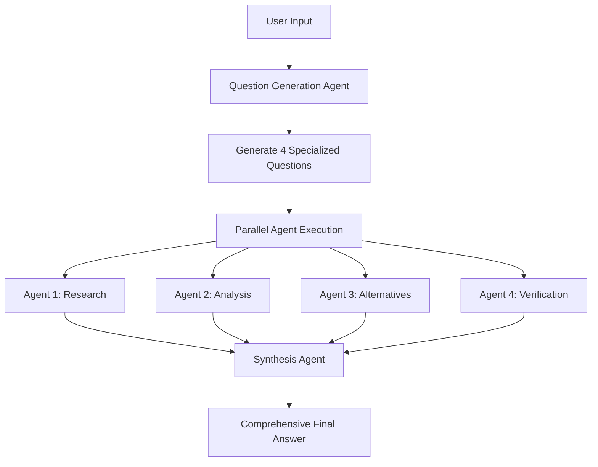

# 🚀 Make It Heavy (TypeScript)

A TypeScript framework to emulate **Grok heavy** functionality using a powerful multi-agent system. Built on OpenRouter's API, Make It Heavy delivers comprehensive, multi-perspective analysis through intelligent agent orchestration.

## 🌟 Features

- **🧠 Grok Heavy Emulation**: Multi-agent system that delivers deep, comprehensive analysis like Grok heavy mode
- **🔀 Parallel Intelligence**: Deploy 4 specialized agents simultaneously for maximum insight coverage
- **🎯 Dynamic Question Generation**: AI creates custom research questions tailored to each query
- **⚡ Real-time Orchestration**: Live visual feedback during multi-agent execution
- **🛠️ Hot-Swappable Tools**: Automatically discovers and loads tools from the `src/tools/` directory
- **🔄 Intelligent Synthesis**: Combines multiple agent perspectives into unified, comprehensive answers
- **🎮 Single Agent Mode**: Run individual agents for simpler tasks with full tool access

## 🚀 Quick Start

### Prerequisites

- Node.js 18+
- npm or yarn
- OpenRouter API key

### Installation

1. **Clone and setup:**
```bash
git clone <repository-url>
cd make-it-heavy-typescript
```

2. **Install dependencies:**
```bash
npm install
```

3. **Configure API key:**
Edit `config.yaml` and replace `YOUR KEY` with your OpenRouter API key.

## 🎯 Usage

### Single Agent Mode

Run a single intelligent agent with full tool access:

```bash
npm run dev
```

**What it does:**
- Loads a single agent with all available tools
- Processes your query step-by-step
- Uses tools like web search, calculator, file operations
- Returns comprehensive response when task is complete

**Example:**
```
User: Research the latest developments in AI and summarize them
Agent: [Uses search tool, analyzes results, provides summary]
```

### Grok Heavy Mode (Multi-Agent Orchestration)

Emulate Grok heavy's deep analysis with 4 parallel intelligent agents:

```bash
npm run dev:heavy
```

**How Make It Heavy works:**
1. **🎯 AI Question Generation**: Creates 4 specialized research questions from your query
2. **🔀 Parallel Intelligence**: Runs 4 agents simultaneously with different analytical perspectives
3. **⚡ Live Progress**: Shows real-time agent status with visual progress bars
4. **🔄 Intelligent Synthesis**: Combines all perspectives into one comprehensive Grok heavy-style answer

**Example Flow:**
```
User Query: "Who is Clay Warren?"

AI Generated Questions:
- Agent 1: "Research Clay Warren's professional background and career history"
- Agent 2: "Analyze Clay Warren's achievements and contributions to technology"  
- Agent 3: "Find alternative perspectives on Clay Warren's work and impact"
- Agent 4: "Verify and cross-check information about Clay Warren's current role"

Result: Grok heavy-style comprehensive analysis combining all agent perspectives
```

## 🏗️ Architecture

### Orchestration Flow



### Core Components

#### 1. Agent System (`src/agent.ts`)
- **Self-contained**: Complete agent implementation with tool access
- **Agentic Loop**: Continues working until task completion
- **Tool Integration**: Automatic tool discovery and execution
- **Configurable**: Uses `config.yaml` for all settings

#### 2. Orchestrator (`src/orchestrator.ts`)
- **Dynamic Question Generation**: AI creates specialized questions
- **Parallel Execution**: Runs multiple agents simultaneously  
- **Response Synthesis**: AI combines all agent outputs
- **Error Handling**: Graceful fallbacks and error recovery

#### 3. Tool System (`src/tools/`)
- **Auto-Discovery**: Automatically loads all tools from directory
- **Hot-Swappable**: Add new tools by creating files in `src/tools/`
- **Standardized Interface**: All tools inherit from `BaseTool`

### Available Tools

| Tool | Purpose | Parameters |
|------|---------|------------|
| `search_web` | Web search with DuckDuckGo | `query`, `max_results` |
| `calculate` | Safe mathematical calculations | `expression` |
| `read_file` | Read file contents | `path`, `head`, `tail` |
| `write_file` | Create/overwrite files | `path`, `content` |
| `mark_task_complete` | Signal task completion | `task_summary`, `completion_message` |

## ⚙️ Configuration

Edit `config.yaml` to customize behavior:

```yaml
# OpenRouter API settings
openrouter:
  api_key: "YOUR KEY"
  base_url: "https://openrouter.ai/api/v1"
  model: "openai/gpt-4.1-mini"  # Change model here

# Agent settings
agent:
  max_iterations: 10

# Orchestrator settings
orchestrator:
  parallel_agents: 4  # Number of parallel agents
  task_timeout: 300   # Timeout per agent (seconds)
  
  # Dynamic question generation prompt
  question_generation_prompt: |
    You are an orchestrator that needs to create {num_agents} different questions...
    
  # Response synthesis prompt  
  synthesis_prompt: |
    You have {num_responses} different AI agents that analyzed the same query...

# Tool settings
search:
  max_results: 5
  user_agent: "Mozilla/5.0 (compatible; OpenRouter Agent)"
```

## 🔧 Development

### Code Quality

- **Linting**: Run `npm run lint` to check code quality with ESLint
- **Linting with fixes**: Run `npm run lint:fix` to auto-fix issues
- **Formatting**: Run `npm run format` to format code with Prettier
- **Format check**: Run `npm run format:check` to verify formatting

### Adding New Tools

1. Create a new file in `src/tools/` directory
2. Inherit from `BaseTool`
3. Implement required methods:

```typescript
import { BaseTool, ToolResult } from './base-tool';

export class MyCustomTool extends BaseTool {
  get name(): string {
    return "my_tool";
  }
  
  get description(): string {
    return "Description of what this tool does";
  }
  
  get parameters(): any {
    return {
      type: "object",
      properties: {
        param: { type: "string", description: "Parameter description" }
      },
      required: ["param"]
    };
  }
  
  async execute(param: string): Promise<ToolResult> {
    // Tool implementation
    return { result: "success" };
  }
}
```

4. The tool will be automatically discovered and loaded!

### Customizing Models

Supports any OpenRouter-compatible model:

```yaml
openrouter:
  model: "anthropic/claude-3.5-sonnet"     # For complex reasoning
  model: "openai/gpt-4.1-mini"             # For cost efficiency  
  model: "google/gemini-2.0-flash-001"     # For speed
  model: "meta-llama/llama-3.1-70b"        # For open source
```

### Adjusting Agent Count

Change number of parallel agents:

```yaml
orchestrator:
  parallel_agents: 6  # Run 6 agents instead of 4
```

**Note**: Make sure your OpenRouter plan supports the concurrent usage!

## 🎮 Examples

### Research Query
```bash
User: "Analyze the impact of AI on software development in 2024"

Single Agent: Comprehensive research report
Grok Heavy Mode: 4 specialized perspectives combined into deep, multi-faceted analysis
```

### Technical Question  
```bash
User: "How do I optimize a React application for performance?"

Single Agent: Step-by-step optimization guide
Grok Heavy Mode: Research + Analysis + Alternatives + Verification = Complete expert guide
```

### Creative Task
```bash
User: "Create a business plan for an AI startup"

Single Agent: Structured business plan
Grok Heavy Mode: Market research + Financial analysis + Competitive landscape + Risk assessment
```

## 🛠️ Troubleshooting

### Common Issues

**API Key Error:**
```
Error: Invalid API key
Solution: Update config.yaml with valid OpenRouter API key
```

**Tool Import Error:**
```
Error: Could not load tool
Solution: Check tool inherits from BaseTool and implements required methods
```

**Synthesis Failure:**
```
🚨 SYNTHESIS FAILED: [error message]
Solution: Check model compatibility and API limits
```

**Timeout Issues:**
```
Agent timeout errors
Solution: Increase task_timeout in config.yaml
```

## 📁 Project Structure

```
make-it-heavy-typescript/
├── src/                    # TypeScript source files
│   ├── main.ts            # Single agent CLI
│   ├── make-it-heavy.ts   # Multi-agent orchestrator CLI  
│   ├── agent.ts           # Core agent implementation
│   ├── orchestrator.ts    # Multi-agent orchestration logic
│   ├── config.ts          # Configuration loader
│   └── tools/             # Tool system
│       ├── index.ts       # Auto-discovery system
│       ├── base-tool.ts   # Tool base class
│       ├── search-tool.ts # Web search
│       ├── calculator-tool.ts # Math calculations  
│       ├── read-file-tool.ts  # File reading
│       ├── write-file-tool.ts # File writing
│       └── task-done-tool.ts  # Task completion
├── dist/                  # Compiled JavaScript output
├── config.yaml            # Configuration file
├── package.json           # Node.js dependencies
├── tsconfig.json          # TypeScript configuration
└── README.md              # This file
```

## 🤝 Contributing

1. Fork the repository
2. Create a feature branch
3. Add new tools or improve existing functionality
4. Test with both single and multi-agent modes
5. Submit a pull request

## 📝 License

MIT License with Commercial Attribution Requirement

**For products with 100K+ users**: Please include attribution to Clay Warren and mention the "Make It Heavy (Typescript)" framework in your documentation or credits.

See [LICENSE](LICENSE) file for full details.

## 🙏 Acknowledgments

- Built with [OpenRouter](https://openrouter.ai/) for LLM API access
- Inspired by **Grok heavy** mode and advanced multi-agent AI systems

---

**Ready to make it heavy?** 🚀

```bash
npm run dev:heavy
```
